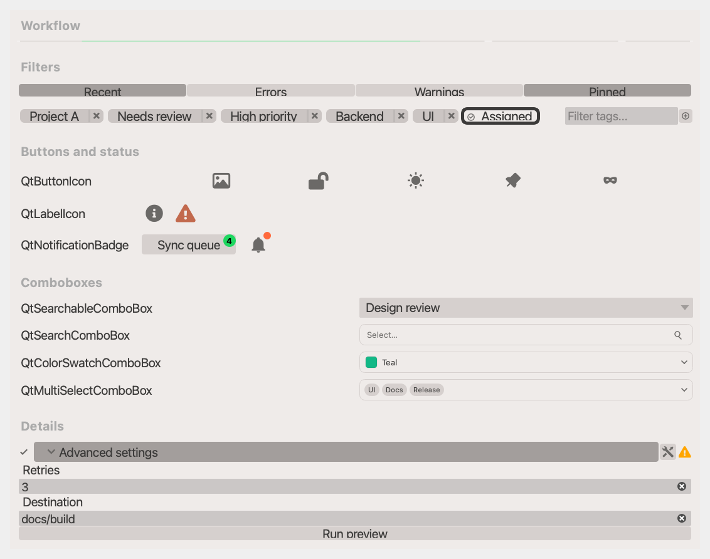

# qtextra

[](https://github.com/lukasz-migas/qtextra/raw/main/LICENSE)
[](https://pypi.org/project/qtextra)
[](https://python.org)
[](https://github.com/lukasz-migas/qtextra/actions/workflows/test_and_deploy.yml)
[](https://codecov.io/gh/lukasz-migas/qtextra)

### Extra widgets and dialogs for PyQt/PySide via `qtpy`

`qtextra` packages reusable Qt widgets, dialogs, and helpers that sit on top of
PyQt/PySide through [`qtpy`](https://github.com/spyder-ide/qtpy). The library
focuses on opinionated, application-level building blocks such as searchable
comboboxes, step progress indicators, styled buttons, collapsible sections, and
utility dialogs.



Components are tested on:

- macOS, Windows & Linux
- Python 3.10 and above
- PyQt5 (5.11 and above) & PyQt6
- PySide2 (5.11 and above) & PySide6

The project overlaps somewhat with [superqt](https://github.com/pyapp-kit/superqt),
but it leans more heavily into application-ready widgets and bundled styling in
[`src/qtextra/assets/stylesheets`](src/qtextra/assets/stylesheets).

## Installation

```bash
pip install qtextra
```

Optional extras:

```bash
pip install "qtextra[console,sentry]"
```

## Quick Start

```python
from qtpy.QtWidgets import QApplication, QVBoxLayout, QWidget

from qtextra.config import THEMES
from qtextra.widgets.qt_collapsible import QtCheckCollapsible
from qtextra.widgets.qt_progress_step import QtStepProgressBar

app = QApplication([])

window = QWidget()
layout = QVBoxLayout(window)

steps = QtStepProgressBar()
steps.labels = ["Load", "Validate", "Export"]
steps.value = 2
layout.addWidget(steps)

details = QtCheckCollapsible("Advanced options")
details.addRow("Status", QWidget())
layout.addWidget(details)

THEMES.apply(window)
window.show()
app.exec_()
```

A larger showcase example is available at [`examples/qt_readme_showcase.py`](examples/showcase.py).

## Documentation

- Automatic widget generation: [`docs/auto.md`](docs/auto.md)
- Mixins reference: [`docs/mixins.md`](docs/mixins.md)
- User guides: [`docs/`](docs)
- Widgets overview: [`docs/widgets/index.md`](docs/widgets/index.md)
- Dialogs overview: [`docs/dialogs/index.md`](docs/dialogs/index.md)
- Examples: [`examples/`](examples)

## Contributing

Contributions are always welcome. Please feel free to submit PRs with new features, bug fixes, or documentation improvements.

```bash
git clone https://github.com/lukasz-migas/qtextra.git

pip install -e ".[dev]"
pytest
```
