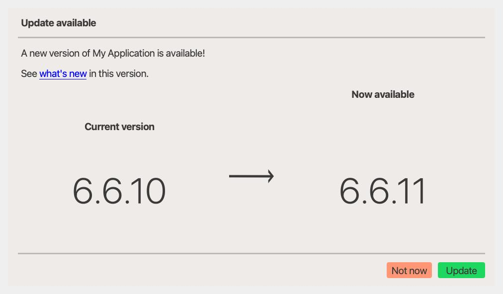

# UpdateAvailableDialog

An application update prompt with primary actions for updating now, later, or reading release notes.

## Screenshot

{ loading=lazy; width=760 }

## Example

Source: `examples/dialog_update_available.py`

{{ include_example('dialog_update_available.py') }}

## Notes

- Pair this dialog with `WhatsNewDialog` or an external changelog page for the release notes flow.
- The dialog emits dedicated signals for update, remind-later, and what's-new actions.

## API

{{ show_members('qtextra.dialogs.qt_update_available.UpdateAvailableDialog') }}

{{ show_members('qtextra.dialogs.qt_update_available.UpdateInfo') }}
