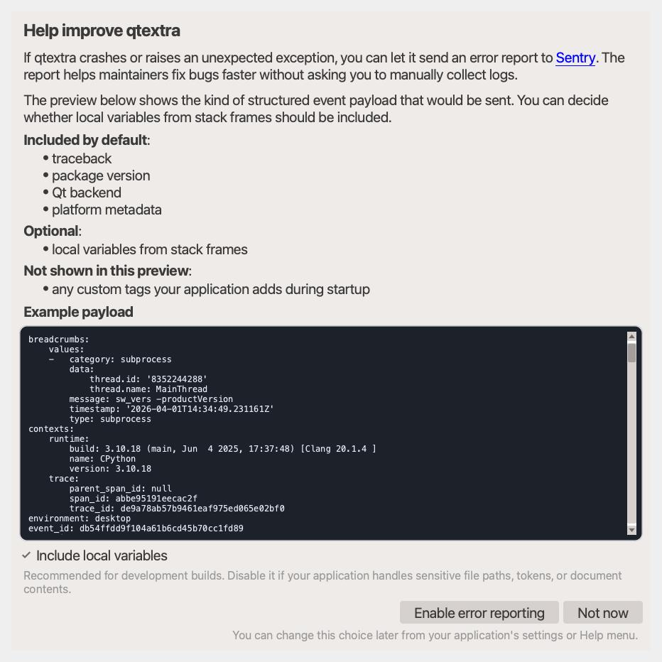

# Sentry Dialogs

`qtextra.dialogs.sentry` provides two related pieces:

- `TelemetryOptInDialog`, which asks the user whether automatic crash reporting
  should be enabled
- `install_error_monitor`, which initializes `sentry-sdk` after the user opts in

## Screenshot

{ loading=lazy; width=760 }

## Example

Source: `examples/dialog_sentry.py`

{{ include_example('dialog_sentry.py') }}

Install the extra first:

```bash
pip install "qtextra[sentry]"
```

## Minimal Setup

The only required environment variable for crash reporting is:

- `QTEXTRA_TELEMETRY_SENTRY_DSN`: the Sentry DSN for the project that should
  receive events

Example:

```bash
export QTEXTRA_TELEMETRY_SENTRY_DSN="https://<key>@o<org>.ingest.sentry.io/<project>"
```

Then initialize telemetry from your application once your settings object is
available:

```python
from qtextra.dialogs.sentry import install_error_monitor

install_error_monitor(settings)
```

`settings` must expose either:

- `telemetry_enabled` and `telemetry_with_locals`, or
- `enabled` and `with_locals`

## Optional Environment Variables

These are not required, but they control the event payload and presentation:

- `QTEXTRA_TELEMETRY_VERSION`: overrides the Sentry release. If omitted,
  `qtextra` falls back to the installed package version or editable git SHA.
- `QTEXTRA_TELEMETRY_PACKAGE`: package name used when resolving the release.
  Defaults to `qtextra`.
- `QTEXTRA_TELEMETRY_ENVIRONMENT`: Sentry environment name. Defaults to
  `desktop`.
- `QTEXTRA_TELEMETRY_SHOW_LOCALS`: `1`/`true` enables local variables in stack
  frames by default. Defaults to enabled.
- `QTEXTRA_TELEMETRY_SHOW_HOSTNAME`: `1`/`true` allows the machine hostname to
  be sent. Defaults to disabled.
- `QTEXTRA_TELEMETRY_DEBUG`: `1`/`true` enables SDK debug logging.
- `QTEXTRA_TELEMETRY_TRACES_SAMPLE_RATE`: trace sampling rate between `0.0`
  and `1.0`. Defaults to `1.0`.
- `QTEXTRA_TELEMETRY_PROFILES_SAMPLE_RATE`: profiling sampling rate between
  `0.0` and `1.0`. Defaults to `1.0`.

## Feedback Configuration

`FeedbackDialog` uses Sentry's user-feedback endpoint and needs three
environment variables:

- `QTEXTRA_TELEMETRY_SENTRY_DSN`
- `QTEXTRA_TELEMETRY_ORGANIZATION`
- `QTEXTRA_TELEMETRY_PROJECT`

Without all three, the feedback dialog still opens but submission is disabled.

The Sentry integration exposes two dialogs:

- `TelemetryOptInDialog` for crash-reporting consent and payload preview
- `FeedbackDialog` for manual product feedback submission

## Privacy Notes

The default configuration sends stack traces, package and Qt metadata, and
basic user information that `sentry-sdk` includes when `send_default_pii=True`.
`qtextra` strips absolute file paths from stack frames before sending events.

The biggest debugging tradeoff is `QTEXTRA_TELEMETRY_SHOW_LOCALS`:

- enable it for better crash diagnosis
- disable it if local variables may contain secrets, document contents, or
  sensitive paths
