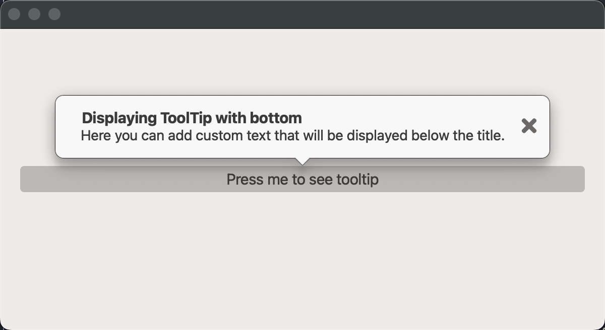

# QtToolTip

Custom tooltip bubbles with tail positions, optional images, and styled content.

## Screenshot

{ loading=lazy; width=760 }

## Example

Source: `examples/qt_tooltip.py`

{{ include_example('qt_tooltip.py') }}
## API

{{ show_members('qtextra.widgets.qt_tooltip.QtToolTip') }}

{{ show_members('qtextra.widgets.qt_tooltip.TipPosition') }}
