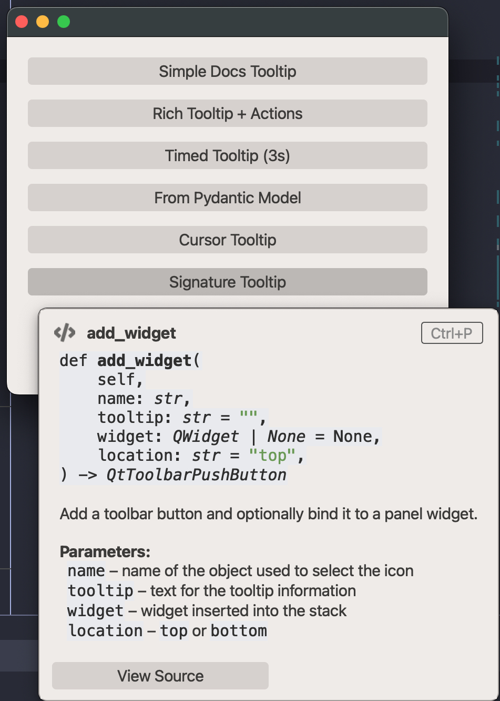

# QtRichToolTip

A PyCharm-style rich tooltip that renders HTML content, displays images and animated GIFs, contains clickable hyperlinks, and supports action buttons in a footer bar.

## Screenshot

{ loading=lazy; width=760 }

## Example

Source: `examples/qt_tooltip_rich.py`

{{ include_example('qt_tooltip_rich.py') }}

## Notes

- The tooltip appears below the target widget by default and flips upward when near the screen edge.
- When the mouse hovers over the tooltip, all dismiss timers are paused so the user can read content and click buttons.
- Only one tooltip is visible at a time (singleton pattern) — showing a new one dismisses the previous.
- Set `duration=-1` for persistent tooltips that dismiss on mouse-leave, or pass a positive millisecond value for auto-dismiss.
- The `<code>` tags in HTML content are automatically styled with theme-aware colors (dark/light mode).
- Use `RichToolTipData` to declaratively define tooltip content as a Pydantic model and pass it to `show_from_data`.

## API

{{ show_members('qtextra.widgets.qt_tooltip_rich.QtRichToolTip') }}

{{ show_members('qtextra.widgets.qt_tooltip_rich.RichToolTipAction') }}

{{ show_members('qtextra.widgets.qt_tooltip_rich.RichToolTipData') }}
